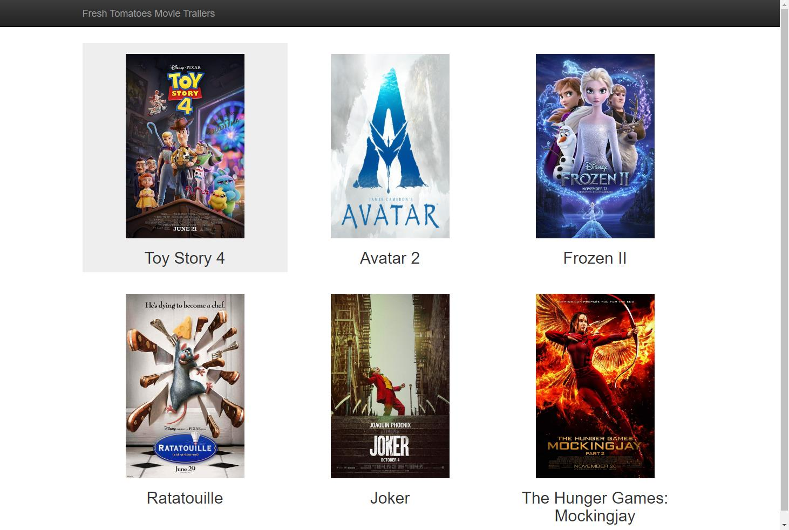

# Capstone_of_Cloud_DevOps_Engineer
## Build static movie web docker with Jenkins pipeline. Deploy the docker in EKS K8S. Do rolling deployment with it.

## How to build & run
build: /docker/build_docker.sh

build & run : /docker/run_docker.sh
## Jenkins Steps:

## How to deploy the docker in EKS
### Create EKS environment
eksctl create cluster \

--name movie-web \

--version 1.14 \

--region us-east-2 \

--nodegroup-name standard-workers \

--node-type t3.medium \

--nodes 2 \

--nodes-min 1 \

--nodes-max 2 \

--node-ami auto
### Deploy docker in EKS
kubectl apply -f ./k8s/movie_web.json 
### Show some information
kubectl get deployments

kubectl get service

kubectl get rs
## How to rolling deployment in EKS
kubectl set image deployments/movieweb-deployment movieweb=zhangjyu/house_flask

kubectl rollout status deployments/movieweb-deployment

kubectl get pods

kubectl rollout undo deployments/movieweb-deployment

kubectl set image deployments/movieweb-deployment movieweb=nginx:1.7.9

kubectl rollout status deployments/movieweb-deployment

kubectl get pods
### Rolling deployment Screenshot

## Delete the Deployment
kubectl delete svc movieweb

eksctl delete cluster --name movie-web

OR

kubectl delete daemonsets,replicasets,services,deployments,pods,rc --all
